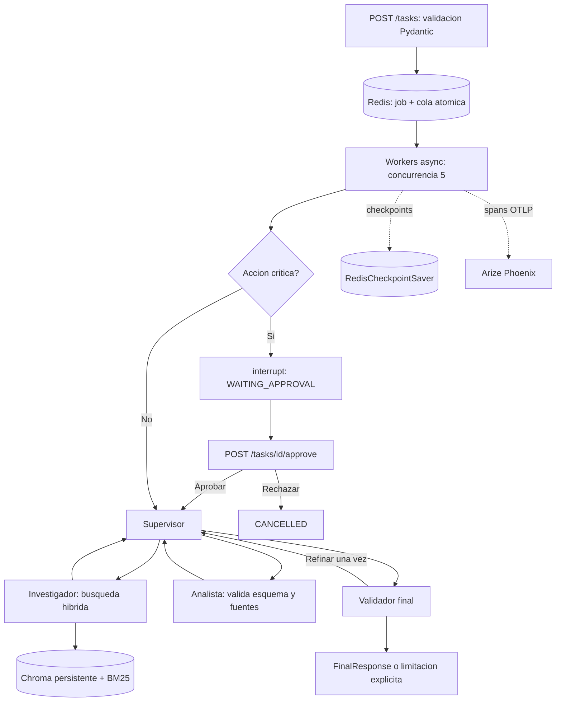

# Sistema Intelligence — AI Engineering

Trabajo de Mauro Tomas Proto Cassina. Python 3.12. Laboratorio local de investigacion tecnica que integra RAG hibrido, un supervisor LangGraph, dos especialistas, FastAPI, Redis y Phoenix. El corpus es original y educativo; no representa datos privados de una empresa.

Este proyecto prepara las pre-entregas 6 y 7 y su integracion para la entrega final. Cada parte tiene su guia en `docs/`. No se presentan mocks como llamadas reales: los dobles de prueba estan identificados como tales.

La ejercitacion opcional M2 U1 esta en [exercises/m2u1_lcel.py](exercises/m2u1_lcel.py), con su [notebook ejecutado](notebooks/m2u1_lcel_demo.ipynb). Usa ChatPromptTemplate | ChatOpenAI compatible con DeepSeek | StrOutputParser y await chain.ainvoke. La ejercitacion M7 U1 tiene un [informe publico](https://mauroproto.github.io/ai-engineering-intelligence/) y [PDF](docs/M7_U1_Observabilidad.pdf). Las preentregas se documentan en [guia 6](docs/preentrega6.md), [guia 7](docs/preentrega7.md) y [final](docs/entrega_final.md).

## Estado de verificacion — 26 de septiembre de 2026

Proyecto verificado con DeepSeek Flash real y embeddings ONNX previamente disponibles, sin descargar modelos ni dependencias durante esta revision. La credencial se recibe en memoria; no se publica ni se guarda en archivos. No hay fallback ni uso de claves de OpenAI o Anthropic.

Quince pruebas pasaron: Redis real, restauracion de interrupt con un grafo nuevo, FAILED, aislamiento de tareas, contratos HTTP simulados identificados, embeddings ONNX reales e indice Chroma real e idempotente. El notebook de `notebooks/preentrega6_demo.ipynb` esta ejecutado sin errores. `evidence/benchmark.json` contiene cinco consultas concurrentes reales y `evidence/hitl.json` una prueba separada de aprobacion y rechazo. La revision manual de respuestas y el alcance de las medidas se explican en `docs/evaluacion.md`.

Los ejercicios individuales de `exercises/` son distintos del proyecto integrado. M7 U2 simula el procesamiento porque su consigna lo pide; M5 U3 utiliza la herramienta de clima de demostracion proporcionada por la actividad. Esto no prueba integracion con servicios meteorologicos ni con un LLM.

## Indice

1. Ejecucion local
2. Arquitectura y contratos
3. API y aprobacion humana
4. Persistencia y recuperacion
5. Observabilidad y pruebas
6. Limitaciones y fuentes

## Ejecucion local

Requiere Python 3.12, Redis y un entorno `.venv` con `requirements.lock.txt` ya instalado. Tambien requiere el modelo ONNX all-MiniLM-L6-v2 en la cache de Chroma y una credencial DeepSeek valida. La preparacion de dependencias en una maquina nueva es un requisito previo: `python3.12 -m venv .venv` y `.venv/bin/python -m pip install -r requirements.lock.txt`. Estos comandos no forman parte de `run.sh` y no se ejecutaron durante esta revision. No se instala ni descarga ningun modelo automaticamente.

```bash
bash run.sh
```

Con `DEEPSEEK_API_KEY` inyectada al entorno, `bash run.sh` comprueba el proveedor y la cache, levanta Redis AOF, Phoenix y la API, y configura las tarifas en Phoenix antes de generar spans. Al salir detiene primero la API y despues sus servicios. No ejecutar si otro servicio ocupa 6389, 6006 o 8091. Una alternativa que evita escribir la clave en el historial es `.venv/bin/python scripts/secure_session.py`: la solicita sin eco y admite `start`, `benchmark`, `notebook`, `stop` y `exit`.

El gateway permite exclusivamente HTTPS oficial de DeepSeek, verifica TLS, ignora proxies y no sigue redirecciones. Lee solo la credencial autorizada del entorno y no registra headers. Redis y Phoenix reciben un entorno sin esa clave. La inferencia ONNX exige una cache completa y falla si falta, en vez de descargar automaticamente.

API documentada en http://127.0.0.1:8091/docs. Dashboard en http://127.0.0.1:8091/dashboard. Phoenix en http://127.0.0.1:6006, proyecto de carga `coderhouse-deepseek-verificado-2026-09-26`. La configuracion no secreta se documenta en `.env.example`; `.env`, `.data` y `.venv` estan ignorados por Git.

## Arquitectura y contratos



El supervisor consulta un modelo con `RouteDecision`, pero una politica determinista impide saltar los requisitos. No puede terminar antes de recibir evidencia, analisis y validacion. `IntelligenceState` registra pregunta, mensajes, artefactos, fuentes, contribuciones por agente y uso del proveedor. Cada especialista recibe solamente la parcela necesaria del estado.

El investigador usa `search_knowledge_base`, herramienta async con `SearchInput`. Chroma guarda embeddings ONNX de 384 dimensiones con metadatos de fuente, pagina y categoria. Los IDs son hashes estables y la ingesta es idempotente. El chunking se mide con tiktoken, 500 tokens y overlap 50. BM25 y ranking vectorial se fusionan con RRF (k=60). El modelo de embeddings no es especializado en espanol; la prueba de recuperacion confirma fuentes concretas para tres consultas, no una evaluacion general de calidad semantica.

El analista usa `validate_research_schema`, comprueba el contrato Pydantic y la pertenencia de las fuentes. Produce `AnalysisArtifact`. El validador final rechaza citas inexistentes, respuestas afirmativas sin evidencia y contradicciones entre sufficient/answerable. Si hay problemas se permite un refinamiento; luego se devuelve una limitacion, no una respuesta no validada. La confianza no equivale a exactitud medida.

## API y aprobacion humana

```bash
curl -X POST http://127.0.0.1:8091/tasks -H 'Content-Type: application/json' \
  -d '{"query":"Como se conservan los checkpoints?"}'
curl http://127.0.0.1:8091/tasks/JOB_ID
```

`POST /tasks` devuelve 202 y job_id inmediatamente. No ejecuta el modelo en el handler. `GET /tasks/{id}` publica el estado y, al terminar, el resultado validado con referencias. Las entradas invalidas devuelven 422 y los identificadores inexistentes 404.

Una consulta con `critical_action: true` pausa el grafo antes de los especialistas. Para retomar el mismo trabajo:

```bash
curl -X POST http://127.0.0.1:8091/tasks/JOB_ID/approve \
  -H 'Content-Type: application/json' \
  -d '{"approved":true,"reason":"Revision humana local"}'
```

La decision se valida con Pydantic y una transaccion WATCH evita doble aprobacion/encolado. Rechazar cambia el trabajo a CANCELLED. En este laboratorio la accion es local y educativa; nunca se realizan compras, envios ni cambios externos.

## Persistencia y recuperacion

Redis conserva la cola, el estado del trabajo y todos los checkpoints. El job y su entrada a cola se escriben en una transaccion. El worker retira el job atomicamente a una cola de procesamiento; si se reinicia, recupera desde el checkpoint y confirma al finalizar. Una lease exclusiva con renovacion evita que dos pools recuperen los mismos trabajos. El despliegue usa un proceso de API con cinco consumidores async.

`RedisCheckpointSaver` implementa la interfaz publica de LangGraph usando Redis estandar, sin modulos opcionales. Guarda checkpoint completo, metadata, parent_config y pending_writes con el serializador tipado de LangGraph, sin pickle. El thread_id es job_id. El interrupt y Command(resume) usan ese mismo hilo. Las pruebas crean un nuevo saver y un nuevo grafo antes de retomar para demostrar que no dependen de memoria local.

AOF conserva datos ante un reinicio normal de Redis; con fsync cada segundo aun existe una ventana de perdida ante fallo abrupto. La garantia de cola es at-least-once. Una llamada al modelo que se corta antes de guardar su checkpoint puede repetirse y consumir mas tokens; las herramientas no tienen efectos externos. Para acciones reales harian falta claves de idempotencia y una outbox. Una clave de idempotencia identifica una operacion y no es una credencial de API.

## Observabilidad y pruebas

Las llamadas HTTP async a DeepSeek se instrumentan con spans OpenInference y OTLP hacia Phoenix local. Se crean spans de la tarea, supervisor, especialistas, herramienta de recuperacion y validacion. Los job_id y trace_id permiten correlacionar Redis con Phoenix. Tokens LLM de entrada, salida y cache se leen de `prompt_tokens`, `completion_tokens` y `prompt_cache_hit_tokens` de usage. Los intentos invalidos anteriores a un reintento exitoso tambien se incluyen. No se inventan tokens ONNX ni se estiman contando caracteres.

El costo se estima separando cache, entrada no cacheada y salida: Flash OFF-PEAK 0,003 / 0,15 / 0,60 USD por millon de tokens, verificado el 26/09/2026. No es una factura. Esas tarifas deben revisarse si cambia el horario o el proveedor. Los embeddings locales no facturan API; no se midieron hardware ni energia. Phoenix necesita un modelo de precios registrado: `scripts/phoenix_pricing.py` lo configura mediante su API GraphQL local, sin credenciales. Las capturas originales de costo por ejecucion, p95 y trazas estan en `screenshots/`.

```bash
REDIS_URL=redis://127.0.0.1:6389/1 .venv/bin/python -m pytest -q
.venv/bin/python -m scripts.benchmark
.venv/bin/python -m scripts.benchmark --include-hitl
.venv/bin/python scripts/build_notebook.py
```

Los tests requieren Redis local activo y el modelo ONNX en cache. Los tests HTTP usan MockTransport y no son ejecuciones de un LLM. El benchmark requiere la API y envia cinco peticiones simultaneas, una de ellas sin respuesta en el corpus. `--include-hitl` agrega aprobacion/rechazo, doble aprobacion 409 y validacion 422; esas tareas deben mantenerse separadas de la muestra de carga de cinco. El notebook documenta delegaciones, herramientas, resultado, referencias y consumo reales. No contiene credenciales ni razonamiento privado del modelo.

La latencia mide encolado a finalizacion. p95 usa interpolacion lineal sobre cinco muestras, suficiente para la ejercitacion pero no para afirmar un SLO. Las fallas pasan a FAILED con una categoria segura; el detalle tecnico queda en la traza local. Los reintentos del gateway estan limitados a tres en errores transitorios/contrato, con timeout y semaforo.

## Limitaciones y fuentes

Este proyecto esta preparado para despliegue local, como pide la consigna. No se afirma que este listo para exponer publicamente. Faltan autenticacion, autorizacion multiusuario, limites por usuario, retencion, cifrado de datos y supervision operacional. La validacion de referencias prueba procedencia y estructura, no garantiza verdad semantica; una evaluacion humana sigue siendo necesaria. No hay Pinecone: el RAG de esta integracion es Chroma local.

[DeepSeek JSON Mode](https://api-docs.deepseek.com/guides/json_mode/), [tarifas y horarios](https://api-docs.deepseek.com/quick_start/pricing/), [modo sin thinking](https://api-docs.deepseek.com/guides/thinking_mode/), [LangGraph interrupt](https://reference.langchain.com/python/langgraph/types/interrupt), [Phoenix tracing](https://arize.com/docs/phoenix/tracing/concepts-tracing/how-does-tracing-work).
